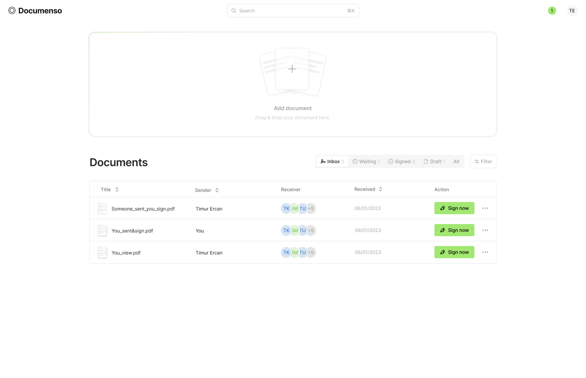

# Documenso CI/CD pipeline

Deploy Documenso server with CI/CD on Elestio

 
 

# Once deployed ...

You can open Documenso here:

    URL: https://[CI_CD_DOMAIN]

You can open pgAdmin here:

    URL: https://[CI_CD_DOMAIN]:28665
    email: [ADMIN_EMAIL]
    password: [ADMIN_PASSWORD]
